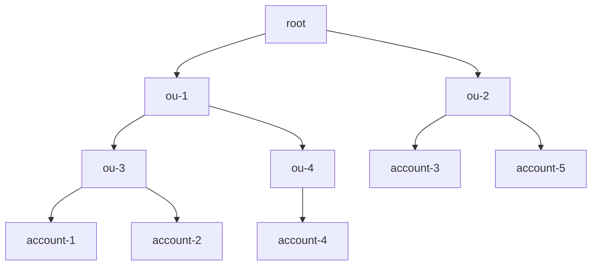

# CDK StackSets Construct Library
<!--BEGIN STABILITY BANNER-->

---


> The APIs of higher level constructs in this module are experimental and under active development.
> They are subject to non-backward compatible changes or removal in any future version. These are
> not subject to the [Semantic Versioning](https://semver.org/) model and breaking changes will be
> announced in the release notes. This means that while you may use them, you may need to update
> your source code when upgrading to a newer version of this package.

---

<!--END STABILITY BANNER-->

This construct library allows you to define AWS CloudFormation StackSets.

```ts
const stack = new Stack();
const stackSetStack = new StackSetStack(stack, 'MyStackSet');

new StackSet(stack, 'StackSet', {
  target: StackSetTarget.fromAccounts({
    regions: ['us-east-1'],
    accounts: ['11111111111'],
    parameterOverrides: {
      SomeParam: 'overrideValue',
    },
  }),
  template: StackSetTemplate.fromStackSetStack(stackSetStack),
});
```

## Installing

### TypeScript/JavaScript

```bash
npm install cdk-stacksets
```

### Python

```bash
pip install cdk-stacksets
```

### Java

```xml
// add this to your pom.xml
<dependency>
    <groupId>io.github.cdklabs</groupId>
    <artifactId>cdk-stacksets</artifactId>
    <version>0.0.0</version> // replace with version
</dependency>
```

### .NET

```bash
dotnet add package CdklabsCdkStacksets --version X.X.X
```

### Go

```bash
go get cdk-stacksets-go
```

## Creating a StackSet Stack

StackSets allow you to deploy a single CloudFormation template across multiple AWS accounts and regions.
Typically when creating a CDK Stack that will be deployed across multiple environments, the CDK will
synthesize separate Stack templates for each environment (account/region combination). Because of the
way that StackSets work, StackSet Stacks behave differently. For Stacks that will be deployed via StackSets
a single Stack is defined and synthesized. Any environmental differences must be encoded using Parameters.

A special class was created to handle the uniqueness of the StackSet Stack.
You declare a `StackSetStack` the same way that you declare a normal `Stack`, but there
are a couple of differences. `StackSetStack`s have a couple of special requirements/limitations when
compared to Stacks.

*Requirements*
- Must be created in the scope of a `Stack`
- Must be environment agnostic

*Limitations*
- Does not support Docker container assets

Once you create a `StackSetStack` you can create resources within the stack.
```ts
const stack = new Stack();
const stackSetStack = new StackSetStack(stack, 'StackSet');

new iam.Role(stackSetStack, 'MyRole', {
  assumedBy: new iam.ServicePrincipal('myservice.amazonaws.com'),
});
```

Or
```ts
class MyStackSet extends StackSetStack {
  constructor(scope: Construct, id: string) {
    super(scope, id);

    new iam.Role(this, 'MyRole', {
      assumedBy: new iam.ServicePrincipal('myservice.amazonaws.com'),
    });
  }
}
```

## Creating a StackSet

AWS CloudFormation StackSets enable you to create, update, or delete stacks across multiple accounts and AWS Regions
with a single operation. Using an administrator account, you define and manage an AWS CloudFormation template, and use
the template as the basis for provisioning stacks into selected target accounts across specific AWS Regions.

There are two methods for defining _where_ the StackSet should be deployed. You can either define individual accounts, or
you can define AWS Organizations organizational units.

### Deploying to individual accounts

Deploying to individual accounts requires you to specify the account ids. If you want to later deploy to additional accounts,
or remove the stackset from accounts, this has to be done by adding/removing the account id from the list.

```ts
const stack = new Stack();
const stackSetStack = new StackSetStack(stack, 'MyStackSet');

new StackSet(stack, 'StackSet', {
  target: StackSetTarget.fromAccounts({
    regions: ['us-east-1'],
    accounts: ['11111111111'],
  }),
  template: StackSetTemplate.fromStackSetStack(stackSetStack),
});
```

### Deploying to organizational units

AWS Organizations is an AWS service that enables you to centrally manage and govern multiple accounts.
AWS Organizations allows you to define organizational units (OUs) which are logical groupings of AWS accounts.
OUs enable you to organize your accounts into a hierarchy and make it easier for you to apply management controls.
For a deep dive on OU best practices you can read the [Best Practices for Organizational Units with AWS Organizations](https://aws.amazon.com/blogs/mt/best-practices-for-organizational-units-with-aws-organizations/) blog post.

You can either specify the organization itself, or individual OUs. By default the StackSet will be deployed
to all AWS accounts that are part of the OU. If the OU is nested it will also deploy to all accounts
that are part of any nested OUs.

For example, given the following org hierarchy



You could deploy to all AWS accounts under OUs `ou-1`, `ou-3`, `ou-4` by specifying the following:

```ts
const stack = new Stack();
const stackSetStack = new StackSetStack(stack, 'MyStackSet');

new StackSet(stack, 'StackSet', {
  target: StackSetTarget.fromOrganizationalUnits({
    regions: ['us-east-1'],
    organizationalUnits: ['ou-1'],
  }),
  template: StackSetTemplate.fromStackSetStack(stackSetStack),
});
```

This would deploy the StackSet to `account-1`, `account-2`, `account-4`.

If there are specific AWS accounts that are part of the specified OU hierarchy that you would like
to exclude, this can be done by specifying `excludeAccounts`.

```ts
const stack = new Stack();
const stackSetStack = new StackSetStack(stack, 'MyStackSet');

new StackSet(stack, 'StackSet', {
  target: StackSetTarget.fromOrganizationalUnits({
    regions: ['us-east-1'],
    organizationalUnits: ['ou-1'],
	excludeAccounts: ['account-2'],
  }),
  template: StackSetTemplate.fromStackSetStack(stackSetStack),
});
```

This would deploy only to `account-1` & `account-4`, and would exclude `account-2`.

Sometimes you might have individual accounts that you would like to deploy the StackSet to, but
you do not want to include the entire OU. To do that you can specify `additionalAccounts`.

```ts
const stack = new Stack();
const stackSetStack = new StackSetStack(stack, 'MyStackSet');

new StackSet(stack, 'StackSet', {
  target: StackSetTarget.fromOrganizationalUnits({
    regions: ['us-east-1'],
    organizationalUnits: ['ou-1'],
	additionalAccounts: ['account-5'],
  }),
  template: StackSetTemplate.fromStackSetStack(stackSetStack),
});
```

This would deploy the StackSet to `account-1`, `account-2`, `account-4` & `account-5`.

### StackSet permissions

There are two modes for managing StackSet permissions (i.e. _where_ StackSets can deploy & _what_ resources they can create).
A StackSet can either be `Service Managed` or `Self Managed`.

You can control this through the `deploymentType` parameter.

#### Service Managed

When a StackSet is service managed, the permissions are managed by AWS Organizations. This allows the StackSet to deploy the Stack to _any_
account within the organization. In addition, the StackSet will be able to create _any_ type of resource.

```ts
const stack = new Stack();
const stackSetStack = new StackSetStack(stack, 'MyStackSet');

new StackSet(stack, 'StackSet', {
  target: StackSetTarget.fromOrganizationalUnits({
    regions: ['us-east-1'],
    organizationalUnits: ['ou-1'],
  }),
  deploymentType: DeploymentType.serviceManaged(),
  template: StackSetTemplate.fromStackSetStack(stackSetStack),
});
```

When you specify `serviceManaged` deployment type, automatic deployments are enabled by default.
Automatic deployments allow the StackSet to be automatically deployed to or deleted from
AWS accounts when they are added or removed from the specified organizational units.

### Using File Assets

You can use the StackSet's parent stack to facilitate file assets. Behind the scenes,
this is accomplished using the `BucketDeployment` construct from the
`aws_s3_deployment` module. You need to provide a bucket outside the scope of the CDK
managed asset buckets and ensure you have persmissions for the target accounts to pull
the artifacts from the supplied bucket.

As a basic example, if using a `serviceManaged` deployment, you just need to give read
access to the Organization. You can create the asset bucket in the parent stack, or another
stack in the same app and pass the object as a prop. Or, import an existing bucket as needed.

If creating in the parent or sibling stack you could create and export similar to this:

```ts
const bucket = new s3.Bucket(this, "Assets", {
  bucketName: "cdkstacket-asset-bucket-xyz",
});

bucket.addToResourcePolicy(
  new iam.PolicyStatement({
    actions: ["s3:Get*", "s3:List*"],
    resources: [bucket.arnForObjects("*"), bucket.bucketArn],
    principals: [new iam.OrganizationPrincipal("o-xyz")],
  })
);
```

Then pass as a prop to the StackSet stack:

```ts
declare const bucket: s3.Bucket;
const stack = new Stack();
const stackSetStack = new StackSetStack(stack, 'MyStackSet', {
  assetBucket: bucket,
});
```

Then call `new StackSet` as described in the sections above.

You can use self-managed StackSet deployments with file assets too but will
need to ensure all target accounts roles will have access to the central asset
bucket you pass as the property.

## Deploying StackSets using CDK Pipelines

You can also deploy StackSets using [CDK Pipelines](https://docs.aws.amazon.com/cdk/api/v2/docs/aws-cdk-lib.pipelines-readme.html)

Below is an example of a Pipeline that deploys from a central account. It also
defines separate stages for each "environment" so that you can first test out
the stackset in pre-prod environments.

This would be an automated way of deploying the bootstrap stack described in
[this blog
post](https://aws.amazon.com/blogs/mt/bootstrapping-multiple-aws-accounts-for-aws-cdk-using-cloudformation-stacksets/).

```ts
declare const app: App;
interface BootstrapStageProps extends StageProps {
  readonly initialBootstrapTarget: StackSetTarget;
  readonly stacksetName?: string;
}

class BootstrapStage extends Stage {
  constructor(scope: Construct, id: string, props: BootstrapStageProps) {
    super(scope, id, props);

    const stack = new Stack(this, 'BootstrapStackSet');

    const bootstrap = new Bootstrap(stack, 'CDKToolkit');

    const stackSet = new StackSet(stack, 'StackSet', {
      template: StackSetTemplate.fromStackSetStack(bootstrap),
      target: props.initialBootstrapTarget,
      capabilities: [Capability.NAMED_IAM],
      managedExecution: true,
      stackSetName: props.stacksetName,
      deploymentType: DeploymentType.serviceManaged({
        delegatedAdmin: true,
        autoDeployEnabled: true,
        autoDeployRetainStacks: false,
      }),
      operationPreferences: {
        regionConcurrencyType: RegionConcurrencyType.PARALLEL,
        maxConcurrentPercentage: 100,
        failureTolerancePercentage: 99,
      },
    });
  }
}


const pipeline = new pipelines.CodePipeline(this, 'BootstrapPipeline', {
  synth: new pipelines.ShellStep('Synth', {
    commands: [
      'yarn install --frozen-lockfile',
      'npx cdk synth',
    ],
    input: pipelines.CodePipelineSource.connection('myorg/myrepo', 'main', {
      connectionArn: 'arn:aws:codestar-connections:us-east-2:111111111111:connection/ca65d487-ca6e-41cc-aab2-645db37fdb2b',
    }),
  }),
  selfMutation: true,
});

const regions = [
  'us-east-1',
  'us-east-2',
  'us-west-2',
  'eu-west-2',
  'eu-west-1',
  'ap-south-1',
  'ap-southeast-1',
];

pipeline.addStage(
  new BootstrapStage(app, 'DevBootstrap', {
    env: {
      region: 'us-east-1',
      account: '111111111111',
    },
    stacksetName: 'CDKToolkit-dev',
    initialBootstrapTarget: StackSetTarget.fromOrganizationalUnits({
      regions,
      organizationalUnits: ['ou-hrza-ar333427'],
    }),
  }),
);

pipeline.addStage(
  new BootstrapStage(app, 'ProdBootstrap', {
    env: {
      region: 'us-east-1',
      account: '111111111111',
    },
    stacksetName: 'CDKToolkit-prd',
    initialBootstrapTarget: StackSetTarget.fromOrganizationalUnits({
      regions,
      organizationalUnits: ['ou-hrza-bb999427', 'ou-hraa-ar111127'],
    }),
  }),
);
```

# API Reference <a name="API Reference" id="api-reference"></a>

## Constructs <a name="Constructs" id="Constructs"></a>

### StackSet <a name="StackSet" id="cdk-stacksets.StackSet"></a>

- *Implements:* <a href="#cdk-stacksets.IStackSet">IStackSet</a>

#### Initializers <a name="Initializers" id="cdk-stacksets.StackSet.Initializer"></a>

```typescript
import { StackSet } from 'cdk-stacksets'

new StackSet(scope: Construct, id: string, props: StackSetProps)
```

| **Name** | **Type** | **Description** |
| --- | --- | --- |
| <code><a href="#cdk-stacksets.StackSet.Initializer.parameter.scope">scope</a></code> | <code>constructs.Construct</code> | *No description.* |
| <code><a href="#cdk-stacksets.StackSet.Initializer.parameter.id">id</a></code> | <code>string</code> | *No description.* |
| <code><a href="#cdk-stacksets.StackSet.Initializer.parameter.props">props</a></code> | <code><a href="#cdk-stacksets.StackSetProps">StackSetProps</a></code> | *No description.* |

---

##### `scope`<sup>Required</sup> <a name="scope" id="cdk-stacksets.StackSet.Initializer.parameter.scope"></a>

- *Type:* constructs.Construct

---

##### `id`<sup>Required</sup> <a name="id" id="cdk-stacksets.StackSet.Initializer.parameter.id"></a>

- *Type:* string

---

##### `props`<sup>Required</sup> <a name="props" id="cdk-stacksets.StackSet.Initializer.parameter.props"></a>

- *Type:* <a href="#cdk-stacksets.StackSetProps">StackSetProps</a>

---

#### Methods <a name="Methods" id="Methods"></a>

| **Name** | **Description** |
| --- | --- |
| <code><a href="#cdk-stacksets.StackSet.toString">toString</a></code> | Returns a string representation of this construct. |
| <code><a href="#cdk-stacksets.StackSet.applyRemovalPolicy">applyRemovalPolicy</a></code> | Apply the given removal policy to this resource. |
| <code><a href="#cdk-stacksets.StackSet.addTarget">addTarget</a></code> | *No description.* |

---

##### `toString` <a name="toString" id="cdk-stacksets.StackSet.toString"></a>

```typescript
public toString(): string
```

Returns a string representation of this construct.

##### `applyRemovalPolicy` <a name="applyRemovalPolicy" id="cdk-stacksets.StackSet.applyRemovalPolicy"></a>

```typescript
public applyRemovalPolicy(policy: RemovalPolicy): void
```

Apply the given removal policy to this resource.

The Removal Policy controls what happens to this resource when it stops
being managed by CloudFormation, either because you've removed it from the
CDK application or because you've made a change that requires the resource
to be replaced.

The resource can be deleted (`RemovalPolicy.DESTROY`), or left in your AWS
account for data recovery and cleanup later (`RemovalPolicy.RETAIN`).

###### `policy`<sup>Required</sup> <a name="policy" id="cdk-stacksets.StackSet.applyRemovalPolicy.parameter.policy"></a>

- *Type:* aws-cdk-lib.RemovalPolicy

---

##### `addTarget` <a name="addTarget" id="cdk-stacksets.StackSet.addTarget"></a>

```typescript
public addTarget(target: StackSetTarget): void
```

###### `target`<sup>Required</sup> <a name="target" id="cdk-stacksets.StackSet.addTarget.parameter.target"></a>

- *Type:* <a href="#cdk-stacksets.StackSetTarget">StackSetTarget</a>

---

#### Static Functions <a name="Static Functions" id="Static Functions"></a>

| **Name** | **Description** |
| --- | --- |
| <code><a href="#cdk-stacksets.StackSet.isConstruct">isConstruct</a></code> | Checks if `x` is a construct. |
| <code><a href="#cdk-stacksets.StackSet.isOwnedResource">isOwnedResource</a></code> | Returns true if the construct was created by CDK, and false otherwise. |
| <code><a href="#cdk-stacksets.StackSet.isResource">isResource</a></code> | Check whether the given construct is a Resource. |

---

##### ~~`isConstruct`~~ <a name="isConstruct" id="cdk-stacksets.StackSet.isConstruct"></a>

```typescript
import { StackSet } from 'cdk-stacksets'

StackSet.isConstruct(x: any)
```

Checks if `x` is a construct.

###### `x`<sup>Required</sup> <a name="x" id="cdk-stacksets.StackSet.isConstruct.parameter.x"></a>

- *Type:* any

Any object.

---

##### `isOwnedResource` <a name="isOwnedResource" id="cdk-stacksets.StackSet.isOwnedResource"></a>

```typescript
import { StackSet } from 'cdk-stacksets'

StackSet.isOwnedResource(construct: IConstruct)
```

Returns true if the construct was created by CDK, and false otherwise.

###### `construct`<sup>Required</sup> <a name="construct" id="cdk-stacksets.StackSet.isOwnedResource.parameter.construct"></a>

- *Type:* constructs.IConstruct

---

##### `isResource` <a name="isResource" id="cdk-stacksets.StackSet.isResource"></a>

```typescript
import { StackSet } from 'cdk-stacksets'

StackSet.isResource(construct: IConstruct)
```

Check whether the given construct is a Resource.

###### `construct`<sup>Required</sup> <a name="construct" id="cdk-stacksets.StackSet.isResource.parameter.construct"></a>

- *Type:* constructs.IConstruct

---

#### Properties <a name="Properties" id="Properties"></a>

| **Name** | **Type** | **Description** |
| --- | --- | --- |
| <code><a href="#cdk-stacksets.StackSet.property.node">node</a></code> | <code>constructs.Node</code> | The tree node. |
| <code><a href="#cdk-stacksets.StackSet.property.env">env</a></code> | <code>aws-cdk-lib.ResourceEnvironment</code> | The environment this resource belongs to. |
| <code><a href="#cdk-stacksets.StackSet.property.stack">stack</a></code> | <code>aws-cdk-lib.Stack</code> | The stack in which this resource is defined. |
| <code><a href="#cdk-stacksets.StackSet.property.role">role</a></code> | <code>aws-cdk-lib.aws_iam.IRole</code> | Only available on self managed stacksets. |

---

##### `node`<sup>Required</sup> <a name="node" id="cdk-stacksets.StackSet.property.node"></a>

```typescript
public readonly node: Node;
```

- *Type:* constructs.Node

The tree node.

---

##### `env`<sup>Required</sup> <a name="env" id="cdk-stacksets.StackSet.property.env"></a>

```typescript
public readonly env: ResourceEnvironment;
```

- *Type:* aws-cdk-lib.ResourceEnvironment

The environment this resource belongs to.

For resources that are created and managed by the CDK
(generally, those created by creating new class instances like Role, Bucket, etc.),
this is always the same as the environment of the stack they belong to;
however, for imported resources
(those obtained from static methods like fromRoleArn, fromBucketName, etc.),
that might be different than the stack they were imported into.

---

##### `stack`<sup>Required</sup> <a name="stack" id="cdk-stacksets.StackSet.property.stack"></a>

```typescript
public readonly stack: Stack;
```

- *Type:* aws-cdk-lib.Stack

The stack in which this resource is defined.

---

##### `role`<sup>Optional</sup> <a name="role" id="cdk-stacksets.StackSet.property.role"></a>

```typescript
public readonly role: IRole;
```

- *Type:* aws-cdk-lib.aws_iam.IRole

Only available on self managed stacksets.

The admin role that CloudFormation will use to perform stackset operations.
This role should only have permissions to be assumed by the CloudFormation service
and to assume the execution role in each individual account.

When you create the execution role it must have an assume role policy statement which
allows `sts:AssumeRole` from this admin role.

To grant specific users/groups access to use this role to deploy stacksets they must have
a policy that allows `iam:GetRole` & `iam:PassRole` on this role resource.

---


### StackSetStack <a name="StackSetStack" id="cdk-stacksets.StackSetStack"></a>

A StackSet stack, which is similar to a normal CloudFormation stack with some differences.

This stack will not be treated as an independent deployment
artifact (won't be listed in "cdk list" or deployable through "cdk deploy"),
but rather only synthesized as a template and uploaded as an asset to S3.

#### Initializers <a name="Initializers" id="cdk-stacksets.StackSetStack.Initializer"></a>

```typescript
import { StackSetStack } from 'cdk-stacksets'

new StackSetStack(scope: Construct, id: string, props?: StackSetStackProps)
```

| **Name** | **Type** | **Description** |
| --- | --- | --- |
| <code><a href="#cdk-stacksets.StackSetStack.Initializer.parameter.scope">scope</a></code> | <code>constructs.Construct</code> | *No description.* |
| <code><a href="#cdk-stacksets.StackSetStack.Initializer.parameter.id">id</a></code> | <code>string</code> | *No description.* |
| <code><a href="#cdk-stacksets.StackSetStack.Initializer.parameter.props">props</a></code> | <code><a href="#cdk-stacksets.StackSetStackProps">StackSetStackProps</a></code> | *No description.* |

---

##### `scope`<sup>Required</sup> <a name="scope" id="cdk-stacksets.StackSetStack.Initializer.parameter.scope"></a>

- *Type:* constructs.Construct

---

##### `id`<sup>Required</sup> <a name="id" id="cdk-stacksets.StackSetStack.Initializer.parameter.id"></a>

- *Type:* string

---

##### `props`<sup>Optional</sup> <a name="props" id="cdk-stacksets.StackSetStack.Initializer.parameter.props"></a>

- *Type:* <a href="#cdk-stacksets.StackSetStackProps">StackSetStackProps</a>

---

#### Methods <a name="Methods" id="Methods"></a>

| **Name** | **Description** |
| --- | --- |
| <code><a href="#cdk-stacksets.StackSetStack.toString">toString</a></code> | Returns a string representation of this construct. |
| <code><a href="#cdk-stacksets.StackSetStack.addDependency">addDependency</a></code> | Add a dependency between this stack and another stack. |
| <code><a href="#cdk-stacksets.StackSetStack.addMetadata">addMetadata</a></code> | Adds an arbitary key-value pair, with information you want to record about the stack. |
| <code><a href="#cdk-stacksets.StackSetStack.addTransform">addTransform</a></code> | Add a Transform to this stack. A Transform is a macro that AWS CloudFormation uses to process your template. |
| <code><a href="#cdk-stacksets.StackSetStack.exportStringListValue">exportStringListValue</a></code> | Create a CloudFormation Export for a string list value. |
| <code><a href="#cdk-stacksets.StackSetStack.exportValue">exportValue</a></code> | Create a CloudFormation Export for a string value. |
| <code><a href="#cdk-stacksets.StackSetStack.formatArn">formatArn</a></code> | Creates an ARN from components. |
| <code><a href="#cdk-stacksets.StackSetStack.getLogicalId">getLogicalId</a></code> | Allocates a stack-unique CloudFormation-compatible logical identity for a specific resource. |
| <code><a href="#cdk-stacksets.StackSetStack.regionalFact">regionalFact</a></code> | Look up a fact value for the given fact for the region of this stack. |
| <code><a href="#cdk-stacksets.StackSetStack.renameLogicalId">renameLogicalId</a></code> | Rename a generated logical identities. |
| <code><a href="#cdk-stacksets.StackSetStack.reportMissingContextKey">reportMissingContextKey</a></code> | Indicate that a context key was expected. |
| <code><a href="#cdk-stacksets.StackSetStack.resolve">resolve</a></code> | Resolve a tokenized value in the context of the current stack. |
| <code><a href="#cdk-stacksets.StackSetStack.splitArn">splitArn</a></code> | Splits the provided ARN into its components. |
| <code><a href="#cdk-stacksets.StackSetStack.toJsonString">toJsonString</a></code> | Convert an object, potentially containing tokens, to a JSON string. |
| <code><a href="#cdk-stacksets.StackSetStack.toYamlString">toYamlString</a></code> | Convert an object, potentially containing tokens, to a YAML string. |

---

##### `toString` <a name="toString" id="cdk-stacksets.StackSetStack.toString"></a>

```typescript
public toString(): string
```

Returns a string representation of this construct.

##### `addDependency` <a name="addDependency" id="cdk-stacksets.StackSetStack.addDependency"></a>

```typescript
public addDependency(target: Stack, reason?: string): void
```

Add a dependency between this stack and another stack.

This can be used to define dependencies between any two stacks within an
app, and also supports nested stacks.

###### `target`<sup>Required</sup> <a name="target" id="cdk-stacksets.StackSetStack.addDependency.parameter.target"></a>

- *Type:* aws-cdk-lib.Stack

---

###### `reason`<sup>Optional</sup> <a name="reason" id="cdk-stacksets.StackSetStack.addDependency.parameter.reason"></a>

- *Type:* string

---

##### `addMetadata` <a name="addMetadata" id="cdk-stacksets.StackSetStack.addMetadata"></a>

```typescript
public addMetadata(key: string, value: any): void
```

Adds an arbitary key-value pair, with information you want to record about the stack.

These get translated to the Metadata section of the generated template.

> [https://docs.aws.amazon.com/AWSCloudFormation/latest/UserGuide/metadata-section-structure.html](https://docs.aws.amazon.com/AWSCloudFormation/latest/UserGuide/metadata-section-structure.html)

###### `key`<sup>Required</sup> <a name="key" id="cdk-stacksets.StackSetStack.addMetadata.parameter.key"></a>

- *Type:* string

---

###### `value`<sup>Required</sup> <a name="value" id="cdk-stacksets.StackSetStack.addMetadata.parameter.value"></a>

- *Type:* any

---

##### `addTransform` <a name="addTransform" id="cdk-stacksets.StackSetStack.addTransform"></a>

```typescript
public addTransform(transform: string): void
```

Add a Transform to this stack. A Transform is a macro that AWS CloudFormation uses to process your template.

Duplicate values are removed when stack is synthesized.

> [https://docs.aws.amazon.com/AWSCloudFormation/latest/UserGuide/transform-section-structure.html](https://docs.aws.amazon.com/AWSCloudFormation/latest/UserGuide/transform-section-structure.html)

*Example*

```typescript
declare const stack: Stack;

stack.addTransform('AWS::Serverless-2016-10-31')
```


###### `transform`<sup>Required</sup> <a name="transform" id="cdk-stacksets.StackSetStack.addTransform.parameter.transform"></a>

- *Type:* string

The transform to add.

---

##### `exportStringListValue` <a name="exportStringListValue" id="cdk-stacksets.StackSetStack.exportStringListValue"></a>

```typescript
public exportStringListValue(exportedValue: any, options?: ExportValueOptions): string[]
```

Create a CloudFormation Export for a string list value.

Returns a string list representing the corresponding `Fn.importValue()`
expression for this Export. The export expression is automatically wrapped with an
`Fn::Join` and the import value with an `Fn::Split`, since CloudFormation can only
export strings. You can control the name for the export by passing the `name` option.

If you don't supply a value for `name`, the value you're exporting must be
a Resource attribute (for example: `bucket.bucketName`) and it will be
given the same name as the automatic cross-stack reference that would be created
if you used the attribute in another Stack.

One of the uses for this method is to *remove* the relationship between
two Stacks established by automatic cross-stack references. It will
temporarily ensure that the CloudFormation Export still exists while you
remove the reference from the consuming stack. After that, you can remove
the resource and the manual export.

See `exportValue` for an example of this process.

###### `exportedValue`<sup>Required</sup> <a name="exportedValue" id="cdk-stacksets.StackSetStack.exportStringListValue.parameter.exportedValue"></a>

- *Type:* any

---

###### `options`<sup>Optional</sup> <a name="options" id="cdk-stacksets.StackSetStack.exportStringListValue.parameter.options"></a>

- *Type:* aws-cdk-lib.ExportValueOptions

---

##### `exportValue` <a name="exportValue" id="cdk-stacksets.StackSetStack.exportValue"></a>

```typescript
public exportValue(exportedValue: any, options?: ExportValueOptions): string
```

Create a CloudFormation Export for a string value.

Returns a string representing the corresponding `Fn.importValue()`
expression for this Export. You can control the name for the export by
passing the `name` option.

If you don't supply a value for `name`, the value you're exporting must be
a Resource attribute (for example: `bucket.bucketName`) and it will be
given the same name as the automatic cross-stack reference that would be created
if you used the attribute in another Stack.

One of the uses for this method is to *remove* the relationship between
two Stacks established by automatic cross-stack references. It will
temporarily ensure that the CloudFormation Export still exists while you
remove the reference from the consuming stack. After that, you can remove
the resource and the manual export.

## Example

Here is how the process works. Let's say there are two stacks,
`producerStack` and `consumerStack`, and `producerStack` has a bucket
called `bucket`, which is referenced by `consumerStack` (perhaps because
an AWS Lambda Function writes into it, or something like that).

It is not safe to remove `producerStack.bucket` because as the bucket is being
deleted, `consumerStack` might still be using it.

Instead, the process takes two deployments:

### Deployment 1: break the relationship

- Make sure `consumerStack` no longer references `bucket.bucketName` (maybe the consumer
  stack now uses its own bucket, or it writes to an AWS DynamoDB table, or maybe you just
  remove the Lambda Function altogether).
- In the `ProducerStack` class, call `this.exportValue(this.bucket.bucketName)`. This
  will make sure the CloudFormation Export continues to exist while the relationship
  between the two stacks is being broken.
- Deploy (this will effectively only change the `consumerStack`, but it's safe to deploy both).

### Deployment 2: remove the bucket resource

- You are now free to remove the `bucket` resource from `producerStack`.
- Don't forget to remove the `exportValue()` call as well.
- Deploy again (this time only the `producerStack` will be changed -- the bucket will be deleted).

###### `exportedValue`<sup>Required</sup> <a name="exportedValue" id="cdk-stacksets.StackSetStack.exportValue.parameter.exportedValue"></a>

- *Type:* any

---

###### `options`<sup>Optional</sup> <a name="options" id="cdk-stacksets.StackSetStack.exportValue.parameter.options"></a>

- *Type:* aws-cdk-lib.ExportValueOptions

---

##### `formatArn` <a name="formatArn" id="cdk-stacksets.StackSetStack.formatArn"></a>

```typescript
public formatArn(components: ArnComponents): string
```

Creates an ARN from components.

If `partition`, `region` or `account` are not specified, the stack's
partition, region and account will be used.

If any component is the empty string, an empty string will be inserted
into the generated ARN at the location that component corresponds to.

The ARN will be formatted as follows:

  arn:{partition}:{service}:{region}:{account}:{resource}{sep}{resource-name}

The required ARN pieces that are omitted will be taken from the stack that
the 'scope' is attached to. If all ARN pieces are supplied, the supplied scope
can be 'undefined'.

###### `components`<sup>Required</sup> <a name="components" id="cdk-stacksets.StackSetStack.formatArn.parameter.components"></a>

- *Type:* aws-cdk-lib.ArnComponents

---

##### `getLogicalId` <a name="getLogicalId" id="cdk-stacksets.StackSetStack.getLogicalId"></a>

```typescript
public getLogicalId(element: CfnElement): string
```

Allocates a stack-unique CloudFormation-compatible logical identity for a specific resource.

This method is called when a `CfnElement` is created and used to render the
initial logical identity of resources. Logical ID renames are applied at
this stage.

This method uses the protected method `allocateLogicalId` to render the
logical ID for an element. To modify the naming scheme, extend the `Stack`
class and override this method.

###### `element`<sup>Required</sup> <a name="element" id="cdk-stacksets.StackSetStack.getLogicalId.parameter.element"></a>

- *Type:* aws-cdk-lib.CfnElement

The CloudFormation element for which a logical identity is needed.

---

##### `regionalFact` <a name="regionalFact" id="cdk-stacksets.StackSetStack.regionalFact"></a>

```typescript
public regionalFact(factName: string, defaultValue?: string): string
```

Look up a fact value for the given fact for the region of this stack.

Will return a definite value only if the region of the current stack is resolved.
If not, a lookup map will be added to the stack and the lookup will be done at
CDK deployment time.

What regions will be included in the lookup map is controlled by the
`@aws-cdk/core:target-partitions` context value: it must be set to a list
of partitions, and only regions from the given partitions will be included.
If no such context key is set, all regions will be included.

This function is intended to be used by construct library authors. Application
builders can rely on the abstractions offered by construct libraries and do
not have to worry about regional facts.

If `defaultValue` is not given, it is an error if the fact is unknown for
the given region.

###### `factName`<sup>Required</sup> <a name="factName" id="cdk-stacksets.StackSetStack.regionalFact.parameter.factName"></a>

- *Type:* string

---

###### `defaultValue`<sup>Optional</sup> <a name="defaultValue" id="cdk-stacksets.StackSetStack.regionalFact.parameter.defaultValue"></a>

- *Type:* string

---

##### `renameLogicalId` <a name="renameLogicalId" id="cdk-stacksets.StackSetStack.renameLogicalId"></a>

```typescript
public renameLogicalId(oldId: string, newId: string): void
```

Rename a generated logical identities.

To modify the naming scheme strategy, extend the `Stack` class and
override the `allocateLogicalId` method.

###### `oldId`<sup>Required</sup> <a name="oldId" id="cdk-stacksets.StackSetStack.renameLogicalId.parameter.oldId"></a>

- *Type:* string

---

###### `newId`<sup>Required</sup> <a name="newId" id="cdk-stacksets.StackSetStack.renameLogicalId.parameter.newId"></a>

- *Type:* string

---

##### `reportMissingContextKey` <a name="reportMissingContextKey" id="cdk-stacksets.StackSetStack.reportMissingContextKey"></a>

```typescript
public reportMissingContextKey(report: MissingContext): void
```

Indicate that a context key was expected.

Contains instructions which will be emitted into the cloud assembly on how
the key should be supplied.

###### `report`<sup>Required</sup> <a name="report" id="cdk-stacksets.StackSetStack.reportMissingContextKey.parameter.report"></a>

- *Type:* aws-cdk-lib.cloud_assembly_schema.MissingContext

The set of parameters needed to obtain the context.

---

##### `resolve` <a name="resolve" id="cdk-stacksets.StackSetStack.resolve"></a>

```typescript
public resolve(obj: any): any
```

Resolve a tokenized value in the context of the current stack.

###### `obj`<sup>Required</sup> <a name="obj" id="cdk-stacksets.StackSetStack.resolve.parameter.obj"></a>

- *Type:* any

---

##### `splitArn` <a name="splitArn" id="cdk-stacksets.StackSetStack.splitArn"></a>

```typescript
public splitArn(arn: string, arnFormat: ArnFormat): ArnComponents
```

Splits the provided ARN into its components.

Works both if 'arn' is a string like 'arn:aws:s3:::bucket',
and a Token representing a dynamic CloudFormation expression
(in which case the returned components will also be dynamic CloudFormation expressions,
encoded as Tokens).

###### `arn`<sup>Required</sup> <a name="arn" id="cdk-stacksets.StackSetStack.splitArn.parameter.arn"></a>

- *Type:* string

the ARN to split into its components.

---

###### `arnFormat`<sup>Required</sup> <a name="arnFormat" id="cdk-stacksets.StackSetStack.splitArn.parameter.arnFormat"></a>

- *Type:* aws-cdk-lib.ArnFormat

the expected format of 'arn' - depends on what format the service 'arn' represents uses.

---

##### `toJsonString` <a name="toJsonString" id="cdk-stacksets.StackSetStack.toJsonString"></a>

```typescript
public toJsonString(obj: any, space?: number): string
```

Convert an object, potentially containing tokens, to a JSON string.

###### `obj`<sup>Required</sup> <a name="obj" id="cdk-stacksets.StackSetStack.toJsonString.parameter.obj"></a>

- *Type:* any

---

###### `space`<sup>Optional</sup> <a name="space" id="cdk-stacksets.StackSetStack.toJsonString.parameter.space"></a>

- *Type:* number

---

##### `toYamlString` <a name="toYamlString" id="cdk-stacksets.StackSetStack.toYamlString"></a>

```typescript
public toYamlString(obj: any): string
```

Convert an object, potentially containing tokens, to a YAML string.

###### `obj`<sup>Required</sup> <a name="obj" id="cdk-stacksets.StackSetStack.toYamlString.parameter.obj"></a>

- *Type:* any

---

#### Static Functions <a name="Static Functions" id="Static Functions"></a>

| **Name** | **Description** |
| --- | --- |
| <code><a href="#cdk-stacksets.StackSetStack.isConstruct">isConstruct</a></code> | Checks if `x` is a construct. |
| <code><a href="#cdk-stacksets.StackSetStack.isStack">isStack</a></code> | Return whether the given object is a Stack. |
| <code><a href="#cdk-stacksets.StackSetStack.of">of</a></code> | Looks up the first stack scope in which `construct` is defined. |

---

##### ~~`isConstruct`~~ <a name="isConstruct" id="cdk-stacksets.StackSetStack.isConstruct"></a>

```typescript
import { StackSetStack } from 'cdk-stacksets'

StackSetStack.isConstruct(x: any)
```

Checks if `x` is a construct.

###### `x`<sup>Required</sup> <a name="x" id="cdk-stacksets.StackSetStack.isConstruct.parameter.x"></a>

- *Type:* any

Any object.

---

##### `isStack` <a name="isStack" id="cdk-stacksets.StackSetStack.isStack"></a>

```typescript
import { StackSetStack } from 'cdk-stacksets'

StackSetStack.isStack(x: any)
```

Return whether the given object is a Stack.

We do attribute detection since we can't reliably use 'instanceof'.

###### `x`<sup>Required</sup> <a name="x" id="cdk-stacksets.StackSetStack.isStack.parameter.x"></a>

- *Type:* any

---

##### `of` <a name="of" id="cdk-stacksets.StackSetStack.of"></a>

```typescript
import { StackSetStack } from 'cdk-stacksets'

StackSetStack.of(construct: IConstruct)
```

Looks up the first stack scope in which `construct` is defined.

Fails if there is no stack up the tree.

###### `construct`<sup>Required</sup> <a name="construct" id="cdk-stacksets.StackSetStack.of.parameter.construct"></a>

- *Type:* constructs.IConstruct

The construct to start the search from.

---

#### Properties <a name="Properties" id="Properties"></a>

| **Name** | **Type** | **Description** |
| --- | --- | --- |
| <code><a href="#cdk-stacksets.StackSetStack.property.node">node</a></code> | <code>constructs.Node</code> | The tree node. |
| <code><a href="#cdk-stacksets.StackSetStack.property.account">account</a></code> | <code>string</code> | The AWS account into which this stack will be deployed. |
| <code><a href="#cdk-stacksets.StackSetStack.property.artifactId">artifactId</a></code> | <code>string</code> | The ID of the cloud assembly artifact for this stack. |
| <code><a href="#cdk-stacksets.StackSetStack.property.availabilityZones">availabilityZones</a></code> | <code>string[]</code> | Returns the list of AZs that are available in the AWS environment (account/region) associated with this stack. |
| <code><a href="#cdk-stacksets.StackSetStack.property.bundlingRequired">bundlingRequired</a></code> | <code>boolean</code> | Indicates whether the stack requires bundling or not. |
| <code><a href="#cdk-stacksets.StackSetStack.property.dependencies">dependencies</a></code> | <code>aws-cdk-lib.Stack[]</code> | Return the stacks this stack depends on. |
| <code><a href="#cdk-stacksets.StackSetStack.property.environment">environment</a></code> | <code>string</code> | The environment coordinates in which this stack is deployed. |
| <code><a href="#cdk-stacksets.StackSetStack.property.nested">nested</a></code> | <code>boolean</code> | Indicates if this is a nested stack, in which case `parentStack` will include a reference to it's parent. |
| <code><a href="#cdk-stacksets.StackSetStack.property.notificationArns">notificationArns</a></code> | <code>string[]</code> | Returns the list of notification Amazon Resource Names (ARNs) for the current stack. |
| <code><a href="#cdk-stacksets.StackSetStack.property.partition">partition</a></code> | <code>string</code> | The partition in which this stack is defined. |
| <code><a href="#cdk-stacksets.StackSetStack.property.region">region</a></code> | <code>string</code> | The AWS region into which this stack will be deployed (e.g. `us-west-2`). |
| <code><a href="#cdk-stacksets.StackSetStack.property.stackId">stackId</a></code> | <code>string</code> | The ID of the stack. |
| <code><a href="#cdk-stacksets.StackSetStack.property.stackName">stackName</a></code> | <code>string</code> | The concrete CloudFormation physical stack name. |
| <code><a href="#cdk-stacksets.StackSetStack.property.synthesizer">synthesizer</a></code> | <code>aws-cdk-lib.IStackSynthesizer</code> | Synthesis method for this stack. |
| <code><a href="#cdk-stacksets.StackSetStack.property.tags">tags</a></code> | <code>aws-cdk-lib.TagManager</code> | Tags to be applied to the stack. |
| <code><a href="#cdk-stacksets.StackSetStack.property.templateFile">templateFile</a></code> | <code>string</code> | The name of the CloudFormation template file emitted to the output
 directory during synthesis. |
| <code><a href="#cdk-stacksets.StackSetStack.property.templateOptions">templateOptions</a></code> | <code>aws-cdk-lib.ITemplateOptions</code> | Options for CloudFormation template (like version, transform, description). |
| <code><a href="#cdk-stacksets.StackSetStack.property.urlSuffix">urlSuffix</a></code> | <code>string</code> | The Amazon domain suffix for the region in which this stack is defined. |
| <code><a href="#cdk-stacksets.StackSetStack.property.nestedStackParent">nestedStackParent</a></code> | <code>aws-cdk-lib.Stack</code> | If this is a nested stack, returns it's parent stack. |
| <code><a href="#cdk-stacksets.StackSetStack.property.nestedStackResource">nestedStackResource</a></code> | <code>aws-cdk-lib.CfnResource</code> | If this is a nested stack, this represents its `AWS::CloudFormation::Stack` resource. |
| <code><a href="#cdk-stacksets.StackSetStack.property.terminationProtection">terminationProtection</a></code> | <code>boolean</code> | Whether termination protection is enabled for this stack. |

---

##### `node`<sup>Required</sup> <a name="node" id="cdk-stacksets.StackSetStack.property.node"></a>

```typescript
public readonly node: Node;
```

- *Type:* constructs.Node

The tree node.

---

##### `account`<sup>Required</sup> <a name="account" id="cdk-stacksets.StackSetStack.property.account"></a>

```typescript
public readonly account: string;
```

- *Type:* string

The AWS account into which this stack will be deployed.

This value is resolved according to the following rules:

1. The value provided to `env.account` when the stack is defined. This can
   either be a concrete account (e.g. `585695031111`) or the
   `Aws.ACCOUNT_ID` token.
3. `Aws.ACCOUNT_ID`, which represents the CloudFormation intrinsic reference
   `{ "Ref": "AWS::AccountId" }` encoded as a string token.

Preferably, you should use the return value as an opaque string and not
attempt to parse it to implement your logic. If you do, you must first
check that it is a concrete value an not an unresolved token. If this
value is an unresolved token (`Token.isUnresolved(stack.account)` returns
`true`), this implies that the user wishes that this stack will synthesize
into a **account-agnostic template**. In this case, your code should either
fail (throw an error, emit a synth error using `Annotations.of(construct).addError()`) or
implement some other region-agnostic behavior.

---

##### `artifactId`<sup>Required</sup> <a name="artifactId" id="cdk-stacksets.StackSetStack.property.artifactId"></a>

```typescript
public readonly artifactId: string;
```

- *Type:* string

The ID of the cloud assembly artifact for this stack.

---

##### `availabilityZones`<sup>Required</sup> <a name="availabilityZones" id="cdk-stacksets.StackSetStack.property.availabilityZones"></a>

```typescript
public readonly availabilityZones: string[];
```

- *Type:* string[]

Returns the list of AZs that are available in the AWS environment (account/region) associated with this stack.

If the stack is environment-agnostic (either account and/or region are
tokens), this property will return an array with 2 tokens that will resolve
at deploy-time to the first two availability zones returned from CloudFormation's
`Fn::GetAZs` intrinsic function.

If they are not available in the context, returns a set of dummy values and
reports them as missing, and let the CLI resolve them by calling EC2
`DescribeAvailabilityZones` on the target environment.

To specify a different strategy for selecting availability zones override this method.

---

##### `bundlingRequired`<sup>Required</sup> <a name="bundlingRequired" id="cdk-stacksets.StackSetStack.property.bundlingRequired"></a>

```typescript
public readonly bundlingRequired: boolean;
```

- *Type:* boolean

Indicates whether the stack requires bundling or not.

---

##### `dependencies`<sup>Required</sup> <a name="dependencies" id="cdk-stacksets.StackSetStack.property.dependencies"></a>

```typescript
public readonly dependencies: Stack[];
```

- *Type:* aws-cdk-lib.Stack[]

Return the stacks this stack depends on.

---

##### `environment`<sup>Required</sup> <a name="environment" id="cdk-stacksets.StackSetStack.property.environment"></a>

```typescript
public readonly environment: string;
```

- *Type:* string

The environment coordinates in which this stack is deployed.

In the form
`aws://account/region`. Use `stack.account` and `stack.region` to obtain
the specific values, no need to parse.

You can use this value to determine if two stacks are targeting the same
environment.

If either `stack.account` or `stack.region` are not concrete values (e.g.
`Aws.ACCOUNT_ID` or `Aws.REGION`) the special strings `unknown-account` and/or
`unknown-region` will be used respectively to indicate this stack is
region/account-agnostic.

---

##### `nested`<sup>Required</sup> <a name="nested" id="cdk-stacksets.StackSetStack.property.nested"></a>

```typescript
public readonly nested: boolean;
```

- *Type:* boolean

Indicates if this is a nested stack, in which case `parentStack` will include a reference to it's parent.

---

##### `notificationArns`<sup>Required</sup> <a name="notificationArns" id="cdk-stacksets.StackSetStack.property.notificationArns"></a>

```typescript
public readonly notificationArns: string[];
```

- *Type:* string[]

Returns the list of notification Amazon Resource Names (ARNs) for the current stack.

---

##### `partition`<sup>Required</sup> <a name="partition" id="cdk-stacksets.StackSetStack.property.partition"></a>

```typescript
public readonly partition: string;
```

- *Type:* string

The partition in which this stack is defined.

---

##### `region`<sup>Required</sup> <a name="region" id="cdk-stacksets.StackSetStack.property.region"></a>

```typescript
public readonly region: string;
```

- *Type:* string

The AWS region into which this stack will be deployed (e.g. `us-west-2`).

This value is resolved according to the following rules:

1. The value provided to `env.region` when the stack is defined. This can
   either be a concrete region (e.g. `us-west-2`) or the `Aws.REGION`
   token.
3. `Aws.REGION`, which is represents the CloudFormation intrinsic reference
   `{ "Ref": "AWS::Region" }` encoded as a string token.

Preferably, you should use the return value as an opaque string and not
attempt to parse it to implement your logic. If you do, you must first
check that it is a concrete value an not an unresolved token. If this
value is an unresolved token (`Token.isUnresolved(stack.region)` returns
`true`), this implies that the user wishes that this stack will synthesize
into a **region-agnostic template**. In this case, your code should either
fail (throw an error, emit a synth error using `Annotations.of(construct).addError()`) or
implement some other region-agnostic behavior.

---

##### `stackId`<sup>Required</sup> <a name="stackId" id="cdk-stacksets.StackSetStack.property.stackId"></a>

```typescript
public readonly stackId: string;
```

- *Type:* string

The ID of the stack.

---

*Example*

```typescript
// After resolving, looks like
'arn:aws:cloudformation:us-west-2:123456789012:stack/teststack/51af3dc0-da77-11e4-872e-1234567db123'
```


##### `stackName`<sup>Required</sup> <a name="stackName" id="cdk-stacksets.StackSetStack.property.stackName"></a>

```typescript
public readonly stackName: string;
```

- *Type:* string

The concrete CloudFormation physical stack name.

This is either the name defined explicitly in the `stackName` prop or
allocated based on the stack's location in the construct tree. Stacks that
are directly defined under the app use their construct `id` as their stack
name. Stacks that are defined deeper within the tree will use a hashed naming
scheme based on the construct path to ensure uniqueness.

If you wish to obtain the deploy-time AWS::StackName intrinsic,
you can use `Aws.STACK_NAME` directly.

---

##### `synthesizer`<sup>Required</sup> <a name="synthesizer" id="cdk-stacksets.StackSetStack.property.synthesizer"></a>

```typescript
public readonly synthesizer: IStackSynthesizer;
```

- *Type:* aws-cdk-lib.IStackSynthesizer

Synthesis method for this stack.

---

##### `tags`<sup>Required</sup> <a name="tags" id="cdk-stacksets.StackSetStack.property.tags"></a>

```typescript
public readonly tags: TagManager;
```

- *Type:* aws-cdk-lib.TagManager

Tags to be applied to the stack.

---

##### `templateFile`<sup>Required</sup> <a name="templateFile" id="cdk-stacksets.StackSetStack.property.templateFile"></a>

```typescript
public readonly templateFile: string;
```

- *Type:* string

The name of the CloudFormation template file emitted to the output
 directory during synthesis.

Example value: `MyStack.template.json`

---

##### `templateOptions`<sup>Required</sup> <a name="templateOptions" id="cdk-stacksets.StackSetStack.property.templateOptions"></a>

```typescript
public readonly templateOptions: ITemplateOptions;
```

- *Type:* aws-cdk-lib.ITemplateOptions

Options for CloudFormation template (like version, transform, description).

---

##### `urlSuffix`<sup>Required</sup> <a name="urlSuffix" id="cdk-stacksets.StackSetStack.property.urlSuffix"></a>

```typescript
public readonly urlSuffix: string;
```

- *Type:* string

The Amazon domain suffix for the region in which this stack is defined.

---

##### `nestedStackParent`<sup>Optional</sup> <a name="nestedStackParent" id="cdk-stacksets.StackSetStack.property.nestedStackParent"></a>

```typescript
public readonly nestedStackParent: Stack;
```

- *Type:* aws-cdk-lib.Stack

If this is a nested stack, returns it's parent stack.

---

##### `nestedStackResource`<sup>Optional</sup> <a name="nestedStackResource" id="cdk-stacksets.StackSetStack.property.nestedStackResource"></a>

```typescript
public readonly nestedStackResource: CfnResource;
```

- *Type:* aws-cdk-lib.CfnResource

If this is a nested stack, this represents its `AWS::CloudFormation::Stack` resource.

`undefined` for top-level (non-nested) stacks.

---

##### `terminationProtection`<sup>Optional</sup> <a name="terminationProtection" id="cdk-stacksets.StackSetStack.property.terminationProtection"></a>

```typescript
public readonly terminationProtection: boolean;
```

- *Type:* boolean

Whether termination protection is enabled for this stack.

---


## Structs <a name="Structs" id="Structs"></a>

### AccountsTargetOptions <a name="AccountsTargetOptions" id="cdk-stacksets.AccountsTargetOptions"></a>

Options for deploying a StackSet to a list of AWS accounts.

#### Initializer <a name="Initializer" id="cdk-stacksets.AccountsTargetOptions.Initializer"></a>

```typescript
import { AccountsTargetOptions } from 'cdk-stacksets'

const accountsTargetOptions: AccountsTargetOptions = { ... }
```

#### Properties <a name="Properties" id="Properties"></a>

| **Name** | **Type** | **Description** |
| --- | --- | --- |
| <code><a href="#cdk-stacksets.AccountsTargetOptions.property.regions">regions</a></code> | <code>string[]</code> | A list of regions the Stack should be deployed to. |
| <code><a href="#cdk-stacksets.AccountsTargetOptions.property.parameterOverrides">parameterOverrides</a></code> | <code>{[ key: string ]: string}</code> | Parameter overrides that should be applied to only this target. |
| <code><a href="#cdk-stacksets.AccountsTargetOptions.property.accounts">accounts</a></code> | <code>string[]</code> | A list of AWS accounts to deploy the StackSet to. |

---

##### `regions`<sup>Required</sup> <a name="regions" id="cdk-stacksets.AccountsTargetOptions.property.regions"></a>

```typescript
public readonly regions: string[];
```

- *Type:* string[]

A list of regions the Stack should be deployed to.

If {@link StackSetProps.operationPreferences.regionOrder} is specified
then the StackSet will be deployed sequentially otherwise it will be
deployed to all regions in parallel.

---

##### `parameterOverrides`<sup>Optional</sup> <a name="parameterOverrides" id="cdk-stacksets.AccountsTargetOptions.property.parameterOverrides"></a>

```typescript
public readonly parameterOverrides: {[ key: string ]: string};
```

- *Type:* {[ key: string ]: string}
- *Default:* use parameter overrides specified in {@link StackSetProps.parameterOverrides}

Parameter overrides that should be applied to only this target.

---

##### `accounts`<sup>Required</sup> <a name="accounts" id="cdk-stacksets.AccountsTargetOptions.property.accounts"></a>

```typescript
public readonly accounts: string[];
```

- *Type:* string[]

A list of AWS accounts to deploy the StackSet to.

---

### OperationPreferences <a name="OperationPreferences" id="cdk-stacksets.OperationPreferences"></a>

#### Initializer <a name="Initializer" id="cdk-stacksets.OperationPreferences.Initializer"></a>

```typescript
import { OperationPreferences } from 'cdk-stacksets'

const operationPreferences: OperationPreferences = { ... }
```

#### Properties <a name="Properties" id="Properties"></a>

| **Name** | **Type** | **Description** |
| --- | --- | --- |
| <code><a href="#cdk-stacksets.OperationPreferences.property.failureToleranceCount">failureToleranceCount</a></code> | <code>number</code> | *No description.* |
| <code><a href="#cdk-stacksets.OperationPreferences.property.failureTolerancePercentage">failureTolerancePercentage</a></code> | <code>number</code> | *No description.* |
| <code><a href="#cdk-stacksets.OperationPreferences.property.maxConcurrentCount">maxConcurrentCount</a></code> | <code>number</code> | *No description.* |
| <code><a href="#cdk-stacksets.OperationPreferences.property.maxConcurrentPercentage">maxConcurrentPercentage</a></code> | <code>number</code> | *No description.* |
| <code><a href="#cdk-stacksets.OperationPreferences.property.regionConcurrencyType">regionConcurrencyType</a></code> | <code><a href="#cdk-stacksets.RegionConcurrencyType">RegionConcurrencyType</a></code> | *No description.* |
| <code><a href="#cdk-stacksets.OperationPreferences.property.regionOrder">regionOrder</a></code> | <code>string[]</code> | *No description.* |

---

##### `failureToleranceCount`<sup>Optional</sup> <a name="failureToleranceCount" id="cdk-stacksets.OperationPreferences.property.failureToleranceCount"></a>

```typescript
public readonly failureToleranceCount: number;
```

- *Type:* number

---

##### `failureTolerancePercentage`<sup>Optional</sup> <a name="failureTolerancePercentage" id="cdk-stacksets.OperationPreferences.property.failureTolerancePercentage"></a>

```typescript
public readonly failureTolerancePercentage: number;
```

- *Type:* number

---

##### `maxConcurrentCount`<sup>Optional</sup> <a name="maxConcurrentCount" id="cdk-stacksets.OperationPreferences.property.maxConcurrentCount"></a>

```typescript
public readonly maxConcurrentCount: number;
```

- *Type:* number

---

##### `maxConcurrentPercentage`<sup>Optional</sup> <a name="maxConcurrentPercentage" id="cdk-stacksets.OperationPreferences.property.maxConcurrentPercentage"></a>

```typescript
public readonly maxConcurrentPercentage: number;
```

- *Type:* number

---

##### `regionConcurrencyType`<sup>Optional</sup> <a name="regionConcurrencyType" id="cdk-stacksets.OperationPreferences.property.regionConcurrencyType"></a>

```typescript
public readonly regionConcurrencyType: RegionConcurrencyType;
```

- *Type:* <a href="#cdk-stacksets.RegionConcurrencyType">RegionConcurrencyType</a>

---

##### `regionOrder`<sup>Optional</sup> <a name="regionOrder" id="cdk-stacksets.OperationPreferences.property.regionOrder"></a>

```typescript
public readonly regionOrder: string[];
```

- *Type:* string[]

---

### OrganizationsTargetOptions <a name="OrganizationsTargetOptions" id="cdk-stacksets.OrganizationsTargetOptions"></a>

Options for deploying a StackSet to a set of Organizational Units (OUs).

#### Initializer <a name="Initializer" id="cdk-stacksets.OrganizationsTargetOptions.Initializer"></a>

```typescript
import { OrganizationsTargetOptions } from 'cdk-stacksets'

const organizationsTargetOptions: OrganizationsTargetOptions = { ... }
```

#### Properties <a name="Properties" id="Properties"></a>

| **Name** | **Type** | **Description** |
| --- | --- | --- |
| <code><a href="#cdk-stacksets.OrganizationsTargetOptions.property.regions">regions</a></code> | <code>string[]</code> | A list of regions the Stack should be deployed to. |
| <code><a href="#cdk-stacksets.OrganizationsTargetOptions.property.parameterOverrides">parameterOverrides</a></code> | <code>{[ key: string ]: string}</code> | Parameter overrides that should be applied to only this target. |
| <code><a href="#cdk-stacksets.OrganizationsTargetOptions.property.organizationalUnits">organizationalUnits</a></code> | <code>string[]</code> | A list of organizational unit ids to deploy to. |
| <code><a href="#cdk-stacksets.OrganizationsTargetOptions.property.additionalAccounts">additionalAccounts</a></code> | <code>string[]</code> | A list of additional AWS accounts to deploy the StackSet to. |
| <code><a href="#cdk-stacksets.OrganizationsTargetOptions.property.excludeAccounts">excludeAccounts</a></code> | <code>string[]</code> | A list of AWS accounts to exclude from deploying the StackSet to. |

---

##### `regions`<sup>Required</sup> <a name="regions" id="cdk-stacksets.OrganizationsTargetOptions.property.regions"></a>

```typescript
public readonly regions: string[];
```

- *Type:* string[]

A list of regions the Stack should be deployed to.

If {@link StackSetProps.operationPreferences.regionOrder} is specified
then the StackSet will be deployed sequentially otherwise it will be
deployed to all regions in parallel.

---

##### `parameterOverrides`<sup>Optional</sup> <a name="parameterOverrides" id="cdk-stacksets.OrganizationsTargetOptions.property.parameterOverrides"></a>

```typescript
public readonly parameterOverrides: {[ key: string ]: string};
```

- *Type:* {[ key: string ]: string}
- *Default:* use parameter overrides specified in {@link StackSetProps.parameterOverrides}

Parameter overrides that should be applied to only this target.

---

##### `organizationalUnits`<sup>Required</sup> <a name="organizationalUnits" id="cdk-stacksets.OrganizationsTargetOptions.property.organizationalUnits"></a>

```typescript
public readonly organizationalUnits: string[];
```

- *Type:* string[]

A list of organizational unit ids to deploy to.

The StackSet will
deploy the provided Stack template to all accounts in the OU.
This can be further filtered by specifying either `additionalAccounts`
or `excludeAccounts`.

If the `deploymentType` is specified with `autoDeployEnabled` then
the StackSet will automatically deploy the Stack to new accounts as they
are added to the specified `organizationalUnits`

---

##### `additionalAccounts`<sup>Optional</sup> <a name="additionalAccounts" id="cdk-stacksets.OrganizationsTargetOptions.property.additionalAccounts"></a>

```typescript
public readonly additionalAccounts: string[];
```

- *Type:* string[]
- *Default:* Stacks will only be deployed to accounts that exist in the specified organizationalUnits

A list of additional AWS accounts to deploy the StackSet to.

This can be
used to deploy the StackSet to additional AWS accounts that exist in a
different OU than what has been provided in `organizationalUnits`

---

##### `excludeAccounts`<sup>Optional</sup> <a name="excludeAccounts" id="cdk-stacksets.OrganizationsTargetOptions.property.excludeAccounts"></a>

```typescript
public readonly excludeAccounts: string[];
```

- *Type:* string[]
- *Default:* Stacks will be deployed to all accounts that exist in the OUs specified in the organizationUnits property

A list of AWS accounts to exclude from deploying the StackSet to.

This can
be useful if there are accounts that exist in an OU that is provided in
`organizationalUnits`, but you do not want the StackSet to be deployed.

---

### SelfManagedOptions <a name="SelfManagedOptions" id="cdk-stacksets.SelfManagedOptions"></a>

Options for StackSets that are not managed by AWS Organizations.

#### Initializer <a name="Initializer" id="cdk-stacksets.SelfManagedOptions.Initializer"></a>

```typescript
import { SelfManagedOptions } from 'cdk-stacksets'

const selfManagedOptions: SelfManagedOptions = { ... }
```

#### Properties <a name="Properties" id="Properties"></a>

| **Name** | **Type** | **Description** |
| --- | --- | --- |
| <code><a href="#cdk-stacksets.SelfManagedOptions.property.adminRole">adminRole</a></code> | <code>aws-cdk-lib.aws_iam.IRole</code> | The admin role that CloudFormation will use to perform stackset operations. |
| <code><a href="#cdk-stacksets.SelfManagedOptions.property.executionRoleName">executionRoleName</a></code> | <code>string</code> | The name of the stackset execution role that already exists in each target AWS account. |

---

##### `adminRole`<sup>Optional</sup> <a name="adminRole" id="cdk-stacksets.SelfManagedOptions.property.adminRole"></a>

```typescript
public readonly adminRole: IRole;
```

- *Type:* aws-cdk-lib.aws_iam.IRole
- *Default:* a default role will be created

The admin role that CloudFormation will use to perform stackset operations.

This role should only have permissions to be assumed by the CloudFormation service
and to assume the execution role in each individual account.

When you create the execution role it must have an assume role policy statement which
allows `sts:AssumeRole` from this admin role.

To grant specific users/groups access to use this role to deploy stacksets they must have
a policy that allows `iam:GetRole` & `iam:PassRole` on this role resource.

---

##### `executionRoleName`<sup>Optional</sup> <a name="executionRoleName" id="cdk-stacksets.SelfManagedOptions.property.executionRoleName"></a>

```typescript
public readonly executionRoleName: string;
```

- *Type:* string
- *Default:* AWSCloudFormationStackSetExecutionRole

The name of the stackset execution role that already exists in each target AWS account.

This role must be configured with a trust policy that allows `sts:AssumeRole` from the `adminRole`.

In addition this role must have the necessary permissions to manage the resources created by the stackset.

> [https://docs.aws.amazon.com/AWSCloudFormation/latest/UserGuide/stacksets-prereqs-self-managed.html#stacksets-prereqs-accountsetup](https://docs.aws.amazon.com/AWSCloudFormation/latest/UserGuide/stacksets-prereqs-self-managed.html#stacksets-prereqs-accountsetup)

---

### ServiceManagedOptions <a name="ServiceManagedOptions" id="cdk-stacksets.ServiceManagedOptions"></a>

Options for StackSets that are managed by AWS Organizations.

#### Initializer <a name="Initializer" id="cdk-stacksets.ServiceManagedOptions.Initializer"></a>

```typescript
import { ServiceManagedOptions } from 'cdk-stacksets'

const serviceManagedOptions: ServiceManagedOptions = { ... }
```

#### Properties <a name="Properties" id="Properties"></a>

| **Name** | **Type** | **Description** |
| --- | --- | --- |
| <code><a href="#cdk-stacksets.ServiceManagedOptions.property.autoDeployEnabled">autoDeployEnabled</a></code> | <code>boolean</code> | Whether or not the StackSet should automatically create/remove the Stack from AWS accounts that are added/removed from an organizational unit. |
| <code><a href="#cdk-stacksets.ServiceManagedOptions.property.autoDeployRetainStacks">autoDeployRetainStacks</a></code> | <code>boolean</code> | Whether stacks should be removed from AWS accounts that are removed from an organizational unit. |
| <code><a href="#cdk-stacksets.ServiceManagedOptions.property.delegatedAdmin">delegatedAdmin</a></code> | <code>boolean</code> | Whether or not the account this StackSet is deployed from is the delegated admin account. |

---

##### `autoDeployEnabled`<sup>Optional</sup> <a name="autoDeployEnabled" id="cdk-stacksets.ServiceManagedOptions.property.autoDeployEnabled"></a>

```typescript
public readonly autoDeployEnabled: boolean;
```

- *Type:* boolean
- *Default:* true

Whether or not the StackSet should automatically create/remove the Stack from AWS accounts that are added/removed from an organizational unit.

This has no effect if {@link StackSetTarget.fromAccounts} is used

---

##### `autoDeployRetainStacks`<sup>Optional</sup> <a name="autoDeployRetainStacks" id="cdk-stacksets.ServiceManagedOptions.property.autoDeployRetainStacks"></a>

```typescript
public readonly autoDeployRetainStacks: boolean;
```

- *Type:* boolean
- *Default:* true

Whether stacks should be removed from AWS accounts that are removed from an organizational unit.

By default the stack will be retained (not deleted)

This has no effect if {@link StackSetTarget.fromAccounts} is used

---

##### `delegatedAdmin`<sup>Optional</sup> <a name="delegatedAdmin" id="cdk-stacksets.ServiceManagedOptions.property.delegatedAdmin"></a>

```typescript
public readonly delegatedAdmin: boolean;
```

- *Type:* boolean
- *Default:* true

Whether or not the account this StackSet is deployed from is the delegated admin account.

Set this to `false` if you are using the AWS Organizations management account instead.

> [https://docs.aws.amazon.com/AWSCloudFormation/latest/UserGuide/stacksets-orgs-delegated-admin.html](https://docs.aws.amazon.com/AWSCloudFormation/latest/UserGuide/stacksets-orgs-delegated-admin.html)

---

### StackSetProps <a name="StackSetProps" id="cdk-stacksets.StackSetProps"></a>

#### Initializer <a name="Initializer" id="cdk-stacksets.StackSetProps.Initializer"></a>

```typescript
import { StackSetProps } from 'cdk-stacksets'

const stackSetProps: StackSetProps = { ... }
```

#### Properties <a name="Properties" id="Properties"></a>

| **Name** | **Type** | **Description** |
| --- | --- | --- |
| <code><a href="#cdk-stacksets.StackSetProps.property.target">target</a></code> | <code><a href="#cdk-stacksets.StackSetTarget">StackSetTarget</a></code> | Which accounts/OUs and regions to deploy the StackSet to. |
| <code><a href="#cdk-stacksets.StackSetProps.property.template">template</a></code> | <code><a href="#cdk-stacksets.StackSetTemplate">StackSetTemplate</a></code> | The Stack that will be deployed to the target. |
| <code><a href="#cdk-stacksets.StackSetProps.property.capabilities">capabilities</a></code> | <code><a href="#cdk-stacksets.Capability">Capability</a>[]</code> | Specify a list of capabilities required by your stackset. |
| <code><a href="#cdk-stacksets.StackSetProps.property.deploymentType">deploymentType</a></code> | <code><a href="#cdk-stacksets.DeploymentType">DeploymentType</a></code> | The type of deployment for this StackSet. |
| <code><a href="#cdk-stacksets.StackSetProps.property.description">description</a></code> | <code>string</code> | An optional description to add to the StackSet. |
| <code><a href="#cdk-stacksets.StackSetProps.property.managedExecution">managedExecution</a></code> | <code>boolean</code> | If this is `true` then StackSets will perform non-conflicting operations concurrently and queue any conflicting operations. |
| <code><a href="#cdk-stacksets.StackSetProps.property.operationPreferences">operationPreferences</a></code> | <code><a href="#cdk-stacksets.OperationPreferences">OperationPreferences</a></code> | *No description.* |
| <code><a href="#cdk-stacksets.StackSetProps.property.stackSetName">stackSetName</a></code> | <code>string</code> | The name of the stack set. |

---

##### `target`<sup>Required</sup> <a name="target" id="cdk-stacksets.StackSetProps.property.target"></a>

```typescript
public readonly target: StackSetTarget;
```

- *Type:* <a href="#cdk-stacksets.StackSetTarget">StackSetTarget</a>

Which accounts/OUs and regions to deploy the StackSet to.

---

##### `template`<sup>Required</sup> <a name="template" id="cdk-stacksets.StackSetProps.property.template"></a>

```typescript
public readonly template: StackSetTemplate;
```

- *Type:* <a href="#cdk-stacksets.StackSetTemplate">StackSetTemplate</a>

The Stack that will be deployed to the target.

---

##### `capabilities`<sup>Optional</sup> <a name="capabilities" id="cdk-stacksets.StackSetProps.property.capabilities"></a>

```typescript
public readonly capabilities: Capability[];
```

- *Type:* <a href="#cdk-stacksets.Capability">Capability</a>[]
- *Default:* no specific capabilities

Specify a list of capabilities required by your stackset.

StackSets that contains certain functionality require an explicit acknowledgement
that the stack contains these capabilities.

If you deploy a stack that requires certain capabilities and they are
not specified, the deployment will fail with a `InsufficientCapabilities` error.

---

##### `deploymentType`<sup>Optional</sup> <a name="deploymentType" id="cdk-stacksets.StackSetProps.property.deploymentType"></a>

```typescript
public readonly deploymentType: DeploymentType;
```

- *Type:* <a href="#cdk-stacksets.DeploymentType">DeploymentType</a>
- *Default:* DeploymentType.self()

The type of deployment for this StackSet.

The deployment can either be managed by
AWS Organizations (i.e. DeploymentType.serviceManaged()) or by the AWS account that
the StackSet is deployed from.

In order to use DeploymentType.serviceManaged() the account needs to either be the
organizations's management account or a delegated administrator account.

---

##### `description`<sup>Optional</sup> <a name="description" id="cdk-stacksets.StackSetProps.property.description"></a>

```typescript
public readonly description: string;
```

- *Type:* string
- *Default:* no description

An optional description to add to the StackSet.

---

##### `managedExecution`<sup>Optional</sup> <a name="managedExecution" id="cdk-stacksets.StackSetProps.property.managedExecution"></a>

```typescript
public readonly managedExecution: boolean;
```

- *Type:* boolean
- *Default:* true

If this is `true` then StackSets will perform non-conflicting operations concurrently and queue any conflicting operations.

This means that you can submit more than one operation per StackSet and they will be
executed concurrently. For example you can submit a single request that updates existing
stack instances *and* creates new stack instances. Any conflicting operations will be queued
for immediate processing once the conflict is resolved.

---

##### `operationPreferences`<sup>Optional</sup> <a name="operationPreferences" id="cdk-stacksets.StackSetProps.property.operationPreferences"></a>

```typescript
public readonly operationPreferences: OperationPreferences;
```

- *Type:* <a href="#cdk-stacksets.OperationPreferences">OperationPreferences</a>

---

##### `stackSetName`<sup>Optional</sup> <a name="stackSetName" id="cdk-stacksets.StackSetProps.property.stackSetName"></a>

```typescript
public readonly stackSetName: string;
```

- *Type:* string
- *Default:* CloudFormation generated name

The name of the stack set.

---

### StackSetStackProps <a name="StackSetStackProps" id="cdk-stacksets.StackSetStackProps"></a>

StackSet stack props.

#### Initializer <a name="Initializer" id="cdk-stacksets.StackSetStackProps.Initializer"></a>

```typescript
import { StackSetStackProps } from 'cdk-stacksets'

const stackSetStackProps: StackSetStackProps = { ... }
```

#### Properties <a name="Properties" id="Properties"></a>

| **Name** | **Type** | **Description** |
| --- | --- | --- |
| <code><a href="#cdk-stacksets.StackSetStackProps.property.assetBucket">assetBucket</a></code> | <code>aws-cdk-lib.aws_s3.IBucket</code> | A Bucket can be passed to store assets, enabling StackSetStack Asset support. |

---

##### `assetBucket`<sup>Optional</sup> <a name="assetBucket" id="cdk-stacksets.StackSetStackProps.property.assetBucket"></a>

```typescript
public readonly assetBucket: IBucket;
```

- *Type:* aws-cdk-lib.aws_s3.IBucket
- *Default:* No Bucket provided and Assets will not be supported.

A Bucket can be passed to store assets, enabling StackSetStack Asset support.

---

### TargetOptions <a name="TargetOptions" id="cdk-stacksets.TargetOptions"></a>

Common options for deploying a StackSet to a target.

#### Initializer <a name="Initializer" id="cdk-stacksets.TargetOptions.Initializer"></a>

```typescript
import { TargetOptions } from 'cdk-stacksets'

const targetOptions: TargetOptions = { ... }
```

#### Properties <a name="Properties" id="Properties"></a>

| **Name** | **Type** | **Description** |
| --- | --- | --- |
| <code><a href="#cdk-stacksets.TargetOptions.property.regions">regions</a></code> | <code>string[]</code> | A list of regions the Stack should be deployed to. |
| <code><a href="#cdk-stacksets.TargetOptions.property.parameterOverrides">parameterOverrides</a></code> | <code>{[ key: string ]: string}</code> | Parameter overrides that should be applied to only this target. |

---

##### `regions`<sup>Required</sup> <a name="regions" id="cdk-stacksets.TargetOptions.property.regions"></a>

```typescript
public readonly regions: string[];
```

- *Type:* string[]

A list of regions the Stack should be deployed to.

If {@link StackSetProps.operationPreferences.regionOrder} is specified
then the StackSet will be deployed sequentially otherwise it will be
deployed to all regions in parallel.

---

##### `parameterOverrides`<sup>Optional</sup> <a name="parameterOverrides" id="cdk-stacksets.TargetOptions.property.parameterOverrides"></a>

```typescript
public readonly parameterOverrides: {[ key: string ]: string};
```

- *Type:* {[ key: string ]: string}
- *Default:* use parameter overrides specified in {@link StackSetProps.parameterOverrides}

Parameter overrides that should be applied to only this target.

---

## Classes <a name="Classes" id="Classes"></a>

### DeploymentType <a name="DeploymentType" id="cdk-stacksets.DeploymentType"></a>

#### Initializers <a name="Initializers" id="cdk-stacksets.DeploymentType.Initializer"></a>

```typescript
import { DeploymentType } from 'cdk-stacksets'

new DeploymentType()
```

| **Name** | **Type** | **Description** |
| --- | --- | --- |

---


#### Static Functions <a name="Static Functions" id="Static Functions"></a>

| **Name** | **Description** |
| --- | --- |
| <code><a href="#cdk-stacksets.DeploymentType.selfManaged">selfManaged</a></code> | StackSets deployed using the self managed model require you to create the necessary IAM roles in the source and target AWS accounts and to setup the required IAM permissions. |
| <code><a href="#cdk-stacksets.DeploymentType.serviceManaged">serviceManaged</a></code> | StackSets deployed using service managed permissions allow you to deploy StackSet instances to accounts within an AWS Organization. |

---

##### `selfManaged` <a name="selfManaged" id="cdk-stacksets.DeploymentType.selfManaged"></a>

```typescript
import { DeploymentType } from 'cdk-stacksets'

DeploymentType.selfManaged(options?: SelfManagedOptions)
```

StackSets deployed using the self managed model require you to create the necessary IAM roles in the source and target AWS accounts and to setup the required IAM permissions.

Using this model you can only deploy to AWS accounts that have the necessary IAM roles/permissions
pre-created.

###### `options`<sup>Optional</sup> <a name="options" id="cdk-stacksets.DeploymentType.selfManaged.parameter.options"></a>

- *Type:* <a href="#cdk-stacksets.SelfManagedOptions">SelfManagedOptions</a>

---

##### `serviceManaged` <a name="serviceManaged" id="cdk-stacksets.DeploymentType.serviceManaged"></a>

```typescript
import { DeploymentType } from 'cdk-stacksets'

DeploymentType.serviceManaged(options?: ServiceManagedOptions)
```

StackSets deployed using service managed permissions allow you to deploy StackSet instances to accounts within an AWS Organization.

Using this module
AWS Organizations will handle creating the necessary IAM roles and setting up the
required permissions.

This model also allows you to enable automated deployments which allows the StackSet
to be automatically deployed to new accounts that are added to your organization in the future.

This model requires you to be operating in either the AWS Organizations management account
or the delegated administrator account

> [https://docs.aws.amazon.com/AWSCloudFormation/latest/UserGuide/stacksets-concepts.html#stacksets-concepts-stackset-permission-models](https://docs.aws.amazon.com/AWSCloudFormation/latest/UserGuide/stacksets-concepts.html#stacksets-concepts-stackset-permission-models)

###### `options`<sup>Optional</sup> <a name="options" id="cdk-stacksets.DeploymentType.serviceManaged.parameter.options"></a>

- *Type:* <a href="#cdk-stacksets.ServiceManagedOptions">ServiceManagedOptions</a>

---


### StackSetStackSynthesizer <a name="StackSetStackSynthesizer" id="cdk-stacksets.StackSetStackSynthesizer"></a>

Deployment environment for an AWS StackSet stack.

Interoperates with the StackSynthesizer of the parent stack.

#### Initializers <a name="Initializers" id="cdk-stacksets.StackSetStackSynthesizer.Initializer"></a>

```typescript
import { StackSetStackSynthesizer } from 'cdk-stacksets'

new StackSetStackSynthesizer(assetBucket?: IBucket)
```

| **Name** | **Type** | **Description** |
| --- | --- | --- |
| <code><a href="#cdk-stacksets.StackSetStackSynthesizer.Initializer.parameter.assetBucket">assetBucket</a></code> | <code>aws-cdk-lib.aws_s3.IBucket</code> | *No description.* |

---

##### `assetBucket`<sup>Optional</sup> <a name="assetBucket" id="cdk-stacksets.StackSetStackSynthesizer.Initializer.parameter.assetBucket"></a>

- *Type:* aws-cdk-lib.aws_s3.IBucket

---

#### Methods <a name="Methods" id="Methods"></a>

| **Name** | **Description** |
| --- | --- |
| <code><a href="#cdk-stacksets.StackSetStackSynthesizer.addDockerImageAsset">addDockerImageAsset</a></code> | Register a Docker Image Asset
 
 Returns the parameters that can be used to refer to the asset inside the template. |
| <code><a href="#cdk-stacksets.StackSetStackSynthesizer.addFileAsset">addFileAsset</a></code> | Register a File Asset
 
 Returns the parameters that can be used to refer to the asset inside the template. |
| <code><a href="#cdk-stacksets.StackSetStackSynthesizer.bind">bind</a></code> | Bind to the stack this environment is going to be used on. |
| <code><a href="#cdk-stacksets.StackSetStackSynthesizer.synthesize">synthesize</a></code> | Synthesize the associated stack to the session. |

---

##### `addDockerImageAsset` <a name="addDockerImageAsset" id="cdk-stacksets.StackSetStackSynthesizer.addDockerImageAsset"></a>

```typescript
public addDockerImageAsset(_asset: DockerImageAssetSource): DockerImageAssetLocation
```

Register a Docker Image Asset
 
 Returns the parameters that can be used to refer to the asset inside the template.

The synthesizer must rely on some out-of-band mechanism to make sure the given files
are actually placed in the returned location before the deployment happens. This can
be by writing the instructions to the asset manifest (for use by the `cdk-assets` tool),
by relying on the CLI to upload files (legacy behavior), or some other operator controlled
mechanism.

###### `_asset`<sup>Required</sup> <a name="_asset" id="cdk-stacksets.StackSetStackSynthesizer.addDockerImageAsset.parameter._asset"></a>

- *Type:* aws-cdk-lib.DockerImageAssetSource

---

##### `addFileAsset` <a name="addFileAsset" id="cdk-stacksets.StackSetStackSynthesizer.addFileAsset"></a>

```typescript
public addFileAsset(_asset: FileAssetSource): FileAssetLocation
```

Register a File Asset
 
 Returns the parameters that can be used to refer to the asset inside the template.

The synthesizer must rely on some out-of-band mechanism to make sure the given files
are actually placed in the returned location before the deployment happens. This can
be by writing the instructions to the asset manifest (for use by the `cdk-assets` tool),
by relying on the CLI to upload files (legacy behavior), or some other operator controlled
mechanism.

###### `_asset`<sup>Required</sup> <a name="_asset" id="cdk-stacksets.StackSetStackSynthesizer.addFileAsset.parameter._asset"></a>

- *Type:* aws-cdk-lib.FileAssetSource

---

##### `bind` <a name="bind" id="cdk-stacksets.StackSetStackSynthesizer.bind"></a>

```typescript
public bind(stack: Stack): void
```

Bind to the stack this environment is going to be used on.

Must be called before any of the other methods are called.

###### `stack`<sup>Required</sup> <a name="stack" id="cdk-stacksets.StackSetStackSynthesizer.bind.parameter.stack"></a>

- *Type:* aws-cdk-lib.Stack

---

##### `synthesize` <a name="synthesize" id="cdk-stacksets.StackSetStackSynthesizer.synthesize"></a>

```typescript
public synthesize(session: ISynthesisSession): void
```

Synthesize the associated stack to the session.

###### `session`<sup>Required</sup> <a name="session" id="cdk-stacksets.StackSetStackSynthesizer.synthesize.parameter.session"></a>

- *Type:* aws-cdk-lib.ISynthesisSession

---


#### Properties <a name="Properties" id="Properties"></a>

| **Name** | **Type** | **Description** |
| --- | --- | --- |
| <code><a href="#cdk-stacksets.StackSetStackSynthesizer.property.bootstrapQualifier">bootstrapQualifier</a></code> | <code>string</code> | The qualifier used to bootstrap this stack. |

---

##### `bootstrapQualifier`<sup>Optional</sup> <a name="bootstrapQualifier" id="cdk-stacksets.StackSetStackSynthesizer.property.bootstrapQualifier"></a>

```typescript
public readonly bootstrapQualifier: string;
```

- *Type:* string

The qualifier used to bootstrap this stack.

---


### StackSetTarget <a name="StackSetTarget" id="cdk-stacksets.StackSetTarget"></a>

Which organizational units and/or accounts the stack set should be deployed to.

`fromAccounts` can be used to deploy the stack set to specific AWS accounts

`fromOrganizationalUnits` can be used to deploy the stack set to specific organizational units
and optionally include additional accounts from other OUs, or exclude accounts from the specified
OUs

*Example*

```typescript
// deploy to specific accounts
StackSetTarget.fromAccounts({
  accounts: ['11111111111', '22222222222'],
  regions: ['us-east-1', 'us-east-2'],
});

// deploy to OUs and 1 additional account
StackSetTarget.fromOrganizationalUnits({
  regions: ['us-east-1', 'us-east-2'],
  organizationalUnits: ['ou-1111111', 'ou-2222222'],
  additionalAccounts: ['33333333333'],
});

// deploy to OUs but exclude 1 account
StackSetTarget.fromOrganizationalUnits({
  regions: ['us-east-1', 'us-east-2'],
  organizationalUnits: ['ou-1111111', 'ou-2222222'],
  excludeAccounts: ['11111111111'],
});
```


#### Initializers <a name="Initializers" id="cdk-stacksets.StackSetTarget.Initializer"></a>

```typescript
import { StackSetTarget } from 'cdk-stacksets'

new StackSetTarget()
```

| **Name** | **Type** | **Description** |
| --- | --- | --- |

---


#### Static Functions <a name="Static Functions" id="Static Functions"></a>

| **Name** | **Description** |
| --- | --- |
| <code><a href="#cdk-stacksets.StackSetTarget.fromAccounts">fromAccounts</a></code> | Deploy the StackSet to a list of accounts. |
| <code><a href="#cdk-stacksets.StackSetTarget.fromOrganizationalUnits">fromOrganizationalUnits</a></code> | Deploy the StackSet to a list of AWS Organizations organizational units. |

---

##### `fromAccounts` <a name="fromAccounts" id="cdk-stacksets.StackSetTarget.fromAccounts"></a>

```typescript
import { StackSetTarget } from 'cdk-stacksets'

StackSetTarget.fromAccounts(options: AccountsTargetOptions)
```

Deploy the StackSet to a list of accounts.

*Example*

```typescript
StackSetTarget.fromAccounts({
  accounts: ['11111111111', '22222222222'],
  regions: ['us-east-1', 'us-east-2'],
});
```


###### `options`<sup>Required</sup> <a name="options" id="cdk-stacksets.StackSetTarget.fromAccounts.parameter.options"></a>

- *Type:* <a href="#cdk-stacksets.AccountsTargetOptions">AccountsTargetOptions</a>

---

##### `fromOrganizationalUnits` <a name="fromOrganizationalUnits" id="cdk-stacksets.StackSetTarget.fromOrganizationalUnits"></a>

```typescript
import { StackSetTarget } from 'cdk-stacksets'

StackSetTarget.fromOrganizationalUnits(options: OrganizationsTargetOptions)
```

Deploy the StackSet to a list of AWS Organizations organizational units.

You can optionally include/exclude individual AWS accounts.

*Example*

```typescript
StackSetTarget.fromOrganizationalUnits({
  regions: ['us-east-1', 'us-east-2'],
  organizationalUnits: ['ou-1111111', 'ou-2222222'],
});
```


###### `options`<sup>Required</sup> <a name="options" id="cdk-stacksets.StackSetTarget.fromOrganizationalUnits.parameter.options"></a>

- *Type:* <a href="#cdk-stacksets.OrganizationsTargetOptions">OrganizationsTargetOptions</a>

---


### StackSetTemplate <a name="StackSetTemplate" id="cdk-stacksets.StackSetTemplate"></a>

Represents a StackSet CloudFormation template.

#### Initializers <a name="Initializers" id="cdk-stacksets.StackSetTemplate.Initializer"></a>

```typescript
import { StackSetTemplate } from 'cdk-stacksets'

new StackSetTemplate()
```

| **Name** | **Type** | **Description** |
| --- | --- | --- |

---


#### Static Functions <a name="Static Functions" id="Static Functions"></a>

| **Name** | **Description** |
| --- | --- |
| <code><a href="#cdk-stacksets.StackSetTemplate.fromStackSetStack">fromStackSetStack</a></code> | *No description.* |

---

##### `fromStackSetStack` <a name="fromStackSetStack" id="cdk-stacksets.StackSetTemplate.fromStackSetStack"></a>

```typescript
import { StackSetTemplate } from 'cdk-stacksets'

StackSetTemplate.fromStackSetStack(stack: StackSetStack)
```

###### `stack`<sup>Required</sup> <a name="stack" id="cdk-stacksets.StackSetTemplate.fromStackSetStack.parameter.stack"></a>

- *Type:* <a href="#cdk-stacksets.StackSetStack">StackSetStack</a>

the stack to use as the base for the stackset template.

---

#### Properties <a name="Properties" id="Properties"></a>

| **Name** | **Type** | **Description** |
| --- | --- | --- |
| <code><a href="#cdk-stacksets.StackSetTemplate.property.templateUrl">templateUrl</a></code> | <code>string</code> | The S3 URL of the StackSet template. |

---

##### `templateUrl`<sup>Required</sup> <a name="templateUrl" id="cdk-stacksets.StackSetTemplate.property.templateUrl"></a>

```typescript
public readonly templateUrl: string;
```

- *Type:* string

The S3 URL of the StackSet template.

---


## Protocols <a name="Protocols" id="Protocols"></a>

### IStackSet <a name="IStackSet" id="cdk-stacksets.IStackSet"></a>

- *Extends:* aws-cdk-lib.IResource

- *Implemented By:* <a href="#cdk-stacksets.StackSet">StackSet</a>, <a href="#cdk-stacksets.IStackSet">IStackSet</a>

Represents a CloudFormation StackSet.


#### Properties <a name="Properties" id="Properties"></a>

| **Name** | **Type** | **Description** |
| --- | --- | --- |
| <code><a href="#cdk-stacksets.IStackSet.property.node">node</a></code> | <code>constructs.Node</code> | The tree node. |
| <code><a href="#cdk-stacksets.IStackSet.property.env">env</a></code> | <code>aws-cdk-lib.ResourceEnvironment</code> | The environment this resource belongs to. |
| <code><a href="#cdk-stacksets.IStackSet.property.stack">stack</a></code> | <code>aws-cdk-lib.Stack</code> | The stack in which this resource is defined. |
| <code><a href="#cdk-stacksets.IStackSet.property.role">role</a></code> | <code>aws-cdk-lib.aws_iam.IRole</code> | Only available on self managed stacksets. |

---

##### `node`<sup>Required</sup> <a name="node" id="cdk-stacksets.IStackSet.property.node"></a>

```typescript
public readonly node: Node;
```

- *Type:* constructs.Node

The tree node.

---

##### `env`<sup>Required</sup> <a name="env" id="cdk-stacksets.IStackSet.property.env"></a>

```typescript
public readonly env: ResourceEnvironment;
```

- *Type:* aws-cdk-lib.ResourceEnvironment

The environment this resource belongs to.

For resources that are created and managed by the CDK
(generally, those created by creating new class instances like Role, Bucket, etc.),
this is always the same as the environment of the stack they belong to;
however, for imported resources
(those obtained from static methods like fromRoleArn, fromBucketName, etc.),
that might be different than the stack they were imported into.

---

##### `stack`<sup>Required</sup> <a name="stack" id="cdk-stacksets.IStackSet.property.stack"></a>

```typescript
public readonly stack: Stack;
```

- *Type:* aws-cdk-lib.Stack

The stack in which this resource is defined.

---

##### `role`<sup>Optional</sup> <a name="role" id="cdk-stacksets.IStackSet.property.role"></a>

```typescript
public readonly role: IRole;
```

- *Type:* aws-cdk-lib.aws_iam.IRole

Only available on self managed stacksets.

The admin role that CloudFormation will use to perform stackset operations.
This role should only have permissions to be assumed by the CloudFormation service
and to assume the execution role in each individual account.

When you create the execution role it must have an assume role policy statement which
allows `sts:AssumeRole` from this admin role.

To grant specific users/groups access to use this role to deploy stacksets they must have
a policy that allows `iam:GetRole` & `iam:PassRole` on this role resource.

---

## Enums <a name="Enums" id="Enums"></a>

### Capability <a name="Capability" id="cdk-stacksets.Capability"></a>

StackSets that contains certain functionality require an explicit acknowledgement that the stack contains these capabilities.

#### Members <a name="Members" id="Members"></a>

| **Name** | **Description** |
| --- | --- |
| <code><a href="#cdk-stacksets.Capability.NAMED_IAM">NAMED_IAM</a></code> | Required if the stack contains IAM resources with custom names. |
| <code><a href="#cdk-stacksets.Capability.IAM">IAM</a></code> | Required if the stack contains IAM resources. |
| <code><a href="#cdk-stacksets.Capability.AUTO_EXPAND">AUTO_EXPAND</a></code> | Required if the stack contains macros. |

---

##### `NAMED_IAM` <a name="NAMED_IAM" id="cdk-stacksets.Capability.NAMED_IAM"></a>

Required if the stack contains IAM resources with custom names.

---


##### `IAM` <a name="IAM" id="cdk-stacksets.Capability.IAM"></a>

Required if the stack contains IAM resources.

If the IAM resources
also have custom names then specify {@link Capability.NAMED_IAM} instead.

---


##### `AUTO_EXPAND` <a name="AUTO_EXPAND" id="cdk-stacksets.Capability.AUTO_EXPAND"></a>

Required if the stack contains macros.

Not supported if deploying
a service managed stackset.

---


### RegionConcurrencyType <a name="RegionConcurrencyType" id="cdk-stacksets.RegionConcurrencyType"></a>

#### Members <a name="Members" id="Members"></a>

| **Name** | **Description** |
| --- | --- |
| <code><a href="#cdk-stacksets.RegionConcurrencyType.SEQUENTIAL">SEQUENTIAL</a></code> | *No description.* |
| <code><a href="#cdk-stacksets.RegionConcurrencyType.PARALLEL">PARALLEL</a></code> | *No description.* |

---

##### `SEQUENTIAL` <a name="SEQUENTIAL" id="cdk-stacksets.RegionConcurrencyType.SEQUENTIAL"></a>

---


##### `PARALLEL` <a name="PARALLEL" id="cdk-stacksets.RegionConcurrencyType.PARALLEL"></a>

---

